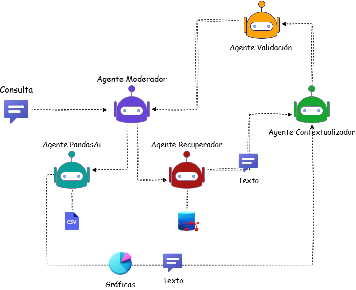
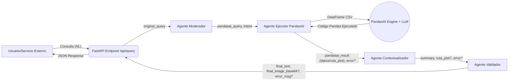

<div align=center>

# 🚢📊 HChat: Un Sistema Multiagente IA 🌊

</div>

<div align=center>

[](https://deepwiki.com/DanRo3/tesis-multiagente)

</div>

---
**Proyecto de Tesis:**

Sistema Inteligente para Consultas en Lenguaje Natural y Visualización de Datos sobre Registros Marítimos Históricos mediante un Enfoque Multiagente y PandasAI.

---

## 📜 Resumen del Proyecto

"HChat" es un sistema avanzado de Inteligencia Artificial diseñado para revolucionar la forma en que interactuamos con datos históricos tabulares, específicamente registros marítimos del "Diario de la Marina". A través de consultas en lenguaje natural (español), este sistema no solo extrae información precisa, sino que también genera respuestas textuales concisas y visualizaciones de datos (gráficas) dinámicamente.

Construido como un microservicio utilizando FastAPI, el núcleo del sistema es una **arquitectura multiagente orquestada con LangGraph**. En esta iteración, el sistema se especializa en el uso de **PandasAI** como motor principal para el análisis de datos y la generación de gráficos, permitiendo una interacción sofisticada y directa con los datos estructurados del archivo CSV. Cada agente se enfoca en una tarea específica (moderación y formulación de consultas, ejecución de análisis con PandasAI, contextualización y validación), asegurando un procesamiento modular, robusto y eficiente.

## ✨ Características Destacadas

*   🗣️ **Procesamiento Avanzado de Lenguaje Natural:** Interpreta consultas complejas de usuarios en español.
*   🐼 **Análisis Inteligente con PandasAI:** Utiliza PandasAI para:
    *   Filtrar datos con precisión sobre múltiples columnas.
    *   Realizar cálculos y agregaciones (conteos, promedios, etc.).
    *   Responder preguntas directas sobre los datos tabulares.
    *   Buscar contenido dentro de columnas textuales (como `parsed_text`).
*   📊 **Generación Dinámica de Gráficos:** PandasAI genera y guarda gráficos (PNG) basados en las solicitudes del usuario.
*   🎯 **Reconocimiento de Intención:** Determina si el usuario busca una respuesta textual o una visualización.
*   📝 **Respuestas Flexibles:** Devuelve resultados en formato texto y/o imagen (codificada en Base64 con Data URI).
*   🤖 **Arquitectura Multiagente Refinada:** Flujo de trabajo orquestado con LangChain/LangGraph, optimizado para PandasAI.
*   🚀 **API Robusta con FastAPI:** Expone la funcionalidad a través de un endpoint claro y eficiente.
*   ⚙️ **Selección Dinámica de LLM:** Configurable para usar diferentes LLMs (OpenAI GPT, Google Gemini) como motor de razonamiento para los agentes y PandasAI.

## 🏗️ Arquitectura del Sistema

El sistema opera como un microservicio FastAPI, donde LangGraph orquesta el siguiente flujo de agentes:
<div align=center>

  

</div>

1.  **Recepción (FastAPI):** El usuario (o un servicio intermediario como un backend Django) envía una consulta vía `POST` al endpoint `/api/query`.
2.  **Agente Moderador:**
    *   Analiza la consulta original del usuario.
    *   Determina la `intent` final (textual o visual).
    *   Transforma la consulta del usuario en una `pandasai_query` precisa y optimizada, indicando a PandasAI qué operación realizar (filtrar, calcular, graficar, buscar en texto) y qué formato de salida se espera.
3.  **Agente Ejecutor PandasAI:**
    *   Recibe la `pandasai_query`.
    *   Inicializa un `SmartDataframe` de PandasAI con el dataset CSV de registros marítimos.
    *   Ejecuta `smart_df.chat(pandasai_query)`.
    *   PandasAI (usando el LLM configurado) genera y ejecuta internamente código Pandas.
    *   Si se solicita un gráfico, PandasAI lo guarda como un archivo PNG y devuelve la ruta al archivo.
    *   Si se solicitan datos, devuelve el resultado (string, número, lista de diccionarios representando un DataFrame, etc.).
4.  **Agente Contextualizador:**
    *   Recibe el resultado del Agente Ejecutor PandasAI.
    *   Si es una ruta a un gráfico, prepara un mensaje simple.
    *   Si son datos textuales o tabulares, los formatea de manera concisa y legible para el usuario (sin usar un LLM adicional para resumir, para mantener la precisión y eficiencia).
5.  **Agente Validador:**
    *   Revisa el resultado final (texto y/o la existencia de una ruta de gráfico) y cualquier error reportado por PandasAI.
    *   Si se generó un gráfico, lee el archivo, lo codifica a Base64 y lo prepara para la respuesta. Elimina el archivo temporal del gráfico.
    *   Si hubo un error en PandasAI, formatea un mensaje de error para el usuario.
    *   Si la respuesta es textual, realiza una validación de coherencia (opcionalmente con un LLM sobre un snippet si la respuesta es muy larga) o la aprueba directamente.
6.  **Entrega (FastAPI):** El endpoint ensambla la respuesta final (texto y/o imagen Base64, o error) en formato JSON y la devuelve.



## 🛠️ Tecnologías Utilizadas

*   **Backend API:** FastAPI
*   **Orquestación de Agentes:** LangChain, LangGraph
*   **Análisis de Datos e IA Conversacional sobre Tablas:** PandasAI
*   **Procesamiento de Datos Tabulares:** Pandas
*   **Modelo Generativo (LLM):** Configurable (OpenAI GPT-4o/GPT-3.5-Turbo, Google Gemini). La selección se realiza vía variables de entorno.
*   **Visualización (Generada por PandasAI):** Matplotlib/Seaborn (usadas internamente por PandasAI)
*   **Lenguaje Principal:** Python 3.9+
*   **Librerías Clave:** `langchain`, `langgraph`, `fastapi`, `uvicorn`, `pandasai`, `pandas`, `openai` (o `google-generativeai`), `python-dotenv`, `matplotlib`, `seaborn`.
*   **Contenerización (Opcional):** Docker

## 📂 Estructura del Proyecto (Simplificada)

```
/tesis-multiagente-bi/
├── app/                      # Código fuente de la aplicación FastAPI
│   ├── api/                  # Endpoints (endpoints.py) y Schemas Pydantic (schemas.py)
│   ├── agents/               # Lógica de cada agente (moderator_agent.py, pandasai_agent.py, etc.)
│   │   └── utils/            # (Si se necesitan utilidades compartidas por agentes)
│   ├── core/                 # Configuración (config.py), LLM (llm.py), carga de DataFrame (dataframe_loader.py)
│   ├── orchestration/        # Definición del grafo Langraph (graph_state.py, agent_nodes.py, graph_builder.py)
│   └── main.py               # Entrypoint de FastAPI y lógica de inicio (lifespan)
├── data/                     # Datos fuente (e.g., tu_archivo.csv)
├── pandasai_charts/          # Directorio donde PandasAI guarda los gráficos generados temporalmente
├── tests/                    # Pruebas (test_pandasai_queries.py para pruebas aisladas)
├── .env.example              # Ejemplo de variables de entorno
├── .gitignore
├── Dockerfile                # (Opcional)
├── requirements.txt          # Dependencias Python
└── README.md                 # ¡Este archivo!
```

## 🚀 Cómo Empezar

### Prerrequisitos

*   Python 3.9+
*   pip (gestor de paquetes de Python)
*   Git

### 1. Clonar el Repositorio

```bash
git clone <url-del-repositorio>
cd tesis-multiagente-bi
```

### 2. Crear Entorno Virtual (Recomendado)

```bash
python -m venv env
# En Windows:
env\Scripts\activate
# En Linux/macOS:
source env/bin/activate
```

### 3. Instalar Dependencias

```bash
pip install -r requirements.txt
```
Asegúrate de que `requirements.txt` incluya `pandasai`, `pandas`, y el conector LLM necesario (e.g., `openai` o `google-generativeai`).

### 4. Configurar Variables de Entorno

Copia `.env.example` a `.env` y edítalo:
```bash
cp .env.example .env # o copy en Windows
```
Abre `.env` y configura:
```dotenv
# .env
LLM_PROVIDER="openai" # O "google"

# Si LLM_PROVIDER="openai"
OPENAI_API_KEY="sk-tu_clave_api_de_openai"
# OPENAI_MODEL_NAME="gpt-4o" # Opcional, se puede definir en config.py

# Si LLM_PROVIDER="google"
# GEMINI_API_KEY="tu_clave_api_de_google_gemini"
# GEMINI_MODEL_NAME="gemini-1.5-flash-latest" # Opcional

# Ruta a tu archivo de datos
CSV_FILE_PATH="data/DataLimpia.csv" # ¡Asegúrate que esta ruta sea correcta!
```

### 5. Preparar Datos
*   Coloca tu archivo CSV (ej. `DataLimpia.csv`) en la carpeta `data/`.
*   Revisa la función de preprocesamiento en `app/core/dataframe_loader.py` y ajústala si es necesario para tus columnas de fecha y duración.

### 6. Ejecutar la Aplicación FastAPI

```bash
uvicorn app.main:app --reload --host 0.0.0.0 --port 8008
```
o
```bash
py runserver.py
```
*   La API estará disponible en `http://localhost:8008`.
*   La documentación interactiva (Swagger UI) estará en `http://localhost:8008/docs`.

## ⚙️ Uso de la API

Interactúa con el sistema enviando peticiones `POST` al endpoint `/api/query`.

**Endpoint:** `POST /api/query`

**Request Body (JSON):**
```json
{
  "query": "Muéstrame un gráfico de barras de los 5 tipos de barco más comunes."
}
```
o
```json
{
  "query": "Lista los nombres de los barcos que llegaron a La Habana en julio de 1851"
}
```

**Response Body (JSON):**
La respuesta puede contener texto, una imagen codificada en Base64, o un error.

*   **Respuesta Textual:**
    ```json
    {
      "text_response": "Se encontraron 41 barcos que salieron de Barcelona. Los primeros son: Duende, Dorotea, Moniquita, Silencio, Curra (... y 36 más).",
      "image_response": null,
      "error": null
    }
    ```
*   **Respuesta Visual (Gráfico):**
    ```json
    {
      "text_response": "Aquí tienes el gráfico solicitado:",
      "image_response": "data:image/png;base64,iVBORw0KGgoAAAANSUhEUgAAA...", // String Base64
      "error": null
    }
    ```
*   **Error:**
    ```json
    {
      "text_response": null,
      "image_response": null,
      "error": "Lo siento, ocurrió un error al procesar: [Detalle del error de PandasAI o del sistema]"
    }
    ```

## ✅ Pruebas Aisladas con PandasAI

Para probar la interacción directa con PandasAI y tu CSV, puedes usar un script como `tests/test_pandasai_queries.py`:

```py
python tests/test_pandasai_queries.py
```
Asegúrate de ajustar las consultas y la configuración dentro de ese script.

## 🤝 Contribuciones

Este es un proyecto de tesis. Las sugerencias para mejorar la robustez, eficiencia y capacidades son bienvenidas. Por favor, abre un *issue* para discutir cambios o mejoras.

---
<p align="center">
  <strong>
    Desarrollado como parte de un proyecto de tesis para optar por el título de Ingeniero en Ciencias Informáticas, por Daniel Rojas Grass en la Universidad de las Ciencias Informáticas (UCI). 🎓
  </strong>
</p>

---

<p align="center">
  <strong>
    DanRo 2025
  </strong>
</p>


